## Reverse Engineering of a <br> Multi-Modal CD8⁺ T-cell Heterogeneity Analysis in Melanoma Immunotherapy
<br>
**Seurat SCT & Intergration  ·  Differential Expression DESeq2/Modulescore  ·  TCR/VDJ Clonotypes  ·  TITAN Topic Modeling  ·  Azimuth  ·  Functional Manual Annotation  ·  GSEA**
<br>

### 1. Project Overview

#### 1.1 Purpose of this Work:

At the core of this repository is the **de novo re-engineering** of the scRNA-seq and bulk RNA-seq data analyses from the **Melanoma study by Mahuron et al. (2025).**

The **authors of the original study provided NO CODE** for the scRNA-seq and bulk RNA-seq analyses (only RDS and RMD files for reproducing the figures).

The **goal was to demonstrate my skills** in analyzing bulk and single-cell RNA-seq data using my domain knowledge of cancer biology and computational skills.

https://pmc.ncbi.nlm.nih.gov/articles/PMC12356630/
<br>
<br>

#### 1.2 Biological Context:

The study investigated patients with **highly “exhausted” CD8+ TILs** (Tumor infiltrating lymphocytes), characterized by **high PD-1/CTLA-4** checkpoint(CP) receptor co-expression and referred to as **CP^Hi TILs**. The frequency of this T-cell population was associated with clinical response to **anti-PD-1 checkpoint inhibitor immunotherapy** in melanoma.
<br>
<br>

#### 1.3 Research Questions / Tasks


**a.** Determine whether **CPᴴⁱ TILs** represent a **uniform cell population** or consist of **different subpopulations**.

**b.** If they are heterogeneous:  

- which **CPᴴⁱ subpopulations** exist?

- which **functional properties** characterize the different CPᴴⁱ subpopulations?

A particular focus was placed on so-called **progenitor exhausted T cells (TPEX cells)** within CPᴴⁱ. **TPEX cells** are a **precursor-like subset** of **exhausted CD8+ T cells**. They possess some capacity for **self-renewal** and can **proliferate** following a PD-1 blockade. Therefore, in previous studies, TPEX cells have frequently been considered particularly important cells for the response to **anti-PD-1 therapy**.

**c.** Check whether **TPEX** cells account for the **majority** of the **CPᴴⁱ** population.
<br>
<br>

#### 1.4 Dataset 

The analyses are based on the publicly available single-cell RNA-seq (GEO: GSE148190) and paired bulk RNA-seq (GEO: GSE147620) datasets. 
<br>
<br>

#### 1.5 Reverse Engineering Constraints 

The public available single cell dataset is based on a **smaller cohort** than the original study. 

The original **immunotherapy response analysis** relied on flow cytometry measurements and clinical treatment outcome data that were not available in the public GEO datasets. Therefore, this project focuses on the **transcriptomic and clonotypic characterization** of immunotherapy-relevant CD8+ T-cell populations(CPᴴⁱ TILs) 
<br>
<br>


#### 1.6 Comparability & Reliable Reproduction Despite the Smaller Cohort

I assess comparability using **UMAPs of Commonalities**(Fig.1c, 1d) based on a **confusion matrix** (chapter 4.11), including the corresponding calculations.

<p align="left">
  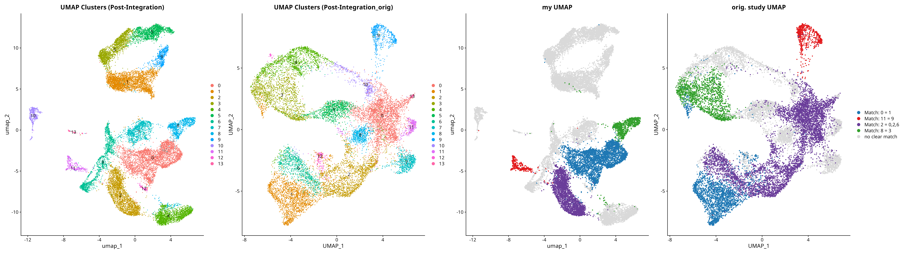
</p>

<p align="left"><em>
Fig.1: **1c and 1d** show that **fundamental cell populations** and key cluster structures remain **largely preserved** despite the smaller number of cells/patients.
</em></p>

**Blood samples** were included as a negative control and to show the complete picture. They are well separated in the UMAP clusters 1, 3, 5, 9 (Fig. 1a) and the tissue analysis (chapter 4.9 ) proves that. Therefore they **do not influence the analysis.**

The **re-engineering** therefore **robustly reproduces the main findings** of the original study across substantial parts of the analysis.
<br>
<br>


### 2. Main Findings / Answers to the Research Questions
<br>
**a.** Determine whether **CPᴴⁱ TILs** represent an **uniform cell population** or consist of **different subpopulations**.
<br>
<br>
First I determine from different perspectives:

**a1.** in which **region(s)** of the UMAP are **CP-Hi** located?

<p align="left">
  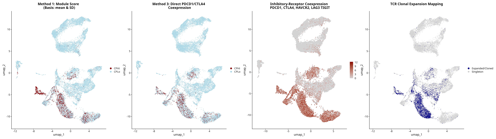
</p>

<p align="left"><em>
Fig2. shows: **CP-Hi** occupies **specific areas** of the UMAP.
</em></p>
<br>


**a2.** Do **CP-Hi** consist of **different subpopulations?**

The comparison of the identified CP-Hi area with the UMAP in Fig. 1a shows that: 

CPhi is concentrated in **more than one region** on the UMAP

- cluster 7 is separated by cluster 0 from the rest of CP-Hi cluster

- cluster 11 and Cluster 4 are separated by whitespace from cluster 6 and and cluster 2

- the different **TITAN topics** in Fig3. **support this thesis**
<br>
<br>

**Conclusion a: CP^Hi CD8⁺ TILs DO NOT represent a single homogeneous exhausted T-cell population**.
<br>
<br>
<br>
**b.** Which **CPᴴⁱ subpopulations** exist and which **functional properties** characterize them?
<br>
<br>
The 3 **Titan topics** and the **gene evidence** from the corresponding  **titan_top_genes list** (chapter 4.16) show: 
**CP^Hi** CD8⁺ TILs form a **complex, functionally heterogeneous spectrum.**
<br>
<br>
<p align="left">
  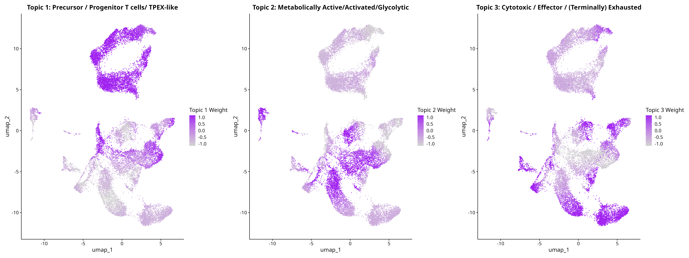
</p>

<p align="left"><em>
Fig 3. Titan Topics
</em></p>
**CPᴴⁱ subpopulation** are:

- predominantly **Topic 3 - Cytotoxic / Effector / (Terminally) Exhausted** T cells

&nbsp;&nbsp;&nbsp;&nbsp;&nbsp;&nbsp;&nbsp;&nbsp;&nbsp;&nbsp;gene evidence: CCL5, NKG7, PRF1, GNLY, GZMA, GZMB, CST7, LAG3.

- partly &nbsp;&nbsp;&nbsp;&nbsp;&nbsp;&nbsp;&nbsp;&nbsp;&nbsp;&nbsp;&nbsp;&nbsp;&nbsp; **Topic 2 - Metabolically Active/Activated/Glycolytic** T cells

&nbsp;&nbsp;&nbsp;&nbsp;&nbsp;&nbsp;&nbsp;&nbsp;&nbsp;&nbsp;gene evidence: LDHA, SLC2A3, GAPDH, TPI1, ALDOA, PGAM1, ENO1, GPI, PGK1, PKM.
<br>
<br>
Topic 1 also answers:
<br>
**c.** whether **TPEX** cells account for the **majority** of the **CPᴴⁱ** population.

- little &nbsp;&nbsp;&nbsp; &nbsp;&nbsp;&nbsp; &nbsp;&nbsp;&nbsp; &nbsp;&nbsp;&nbsp; &nbsp;&nbsp; **Topic 1 - Precursor / Progenitor / TPEX-like** T cells

&nbsp;&nbsp;&nbsp;&nbsp;&nbsp;&nbsp;&nbsp;&nbsp;&nbsp;&nbsp;gene evidence: IL7R, LTB, TXNIP, ZFP36, ZFP36L2, TCF7, LEF1.
<br>
<br>
**Conclusion c: TPEX-like** represent only a **small proportion of CP-Hi.**
<br>
<br>


### 3. Workflow overview

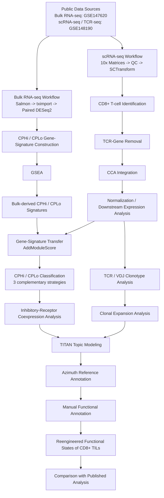
<br>


### 4. Results 
<br>

### Bulk RNA-seq Results
<br>

#### 4.1 Paired differential expression from 5 samples identifies transcriptional differences between CP^Hi and CP^Lo TILs 
<br>

#### 4.2 Ranking and CP^Hi and CP^Lo Gene Signatures based on differential expression results

CP-Hi: log2FoldChange > 0 & padj < 0.05;

CP-Lo: log2FoldChange < 0 & padj < 0.05


<br>
<p align="left">
  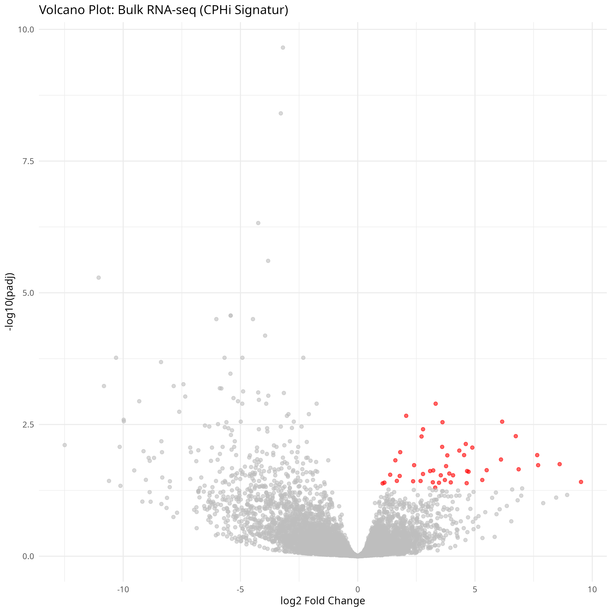
</p>

**Result: 46 CP-Hi genes are statistically significant. We use these as a robust CP-Hi signature in the sc-analysis.**
```
> cphi_sig_ena
 [1] "MYO7A"      "XXYLT1-AS2" "CXCL13"     "BUB1B"      "FDXR"       "MCM2"       "SHCBP1"     "PLK4"       "ETV7"       "PDCD1"      "CD80"       "NCEH1"     
[13] "KIFC1"      "HMMR"       "DLGAP5"     "ZBED2"      "LINC00158"  "DPP3"       "TCF19"      "E2F2"       "CDC25C"     "TRPC3"      "DOK6"       "UBE2T"     
[25] "ZNF304"     "RBBP9"      "NUF2"       "PTPRN2"     "KIF2C"      "UBE2C"      "TMED8"      "DDIAS"      "HJURP"      "DEPDC1B"    "ATAD5"      "TCHP"      
[37] "LINC01480"  "CCNB1"      "NDC1"       "HSPA14"     "YIF1B"     ...

```

1. MYO7A, Intracellular transport: Encodes myosin VIIA, an actin-based motor involved in intracellular transport.
It supports the organization and function of sensory cells in the inner ear and retina.
Pathogenic variants can cause hearing loss and Usher syndrome.

**2. XXYLT1-AS2, Endothelial inflammation:** Encodes an antisense long noncoding RNA associated with the XXYLT1 locus.
In endothelial-cell experiments, it regulates proliferation and migration through the RNA-binding protein FUS.
It can also reduce monocyte adhesion and inflammatory signaling in this experimental setting.

**3. CXCL13, Immune response:** Encodes a chemokine that attracts B lymphocytes through the receptor CXCR5.
It guides B cells into follicles within lymph nodes, spleen and other lymphoid tissues.
This positioning helps organize the cellular interactions underlying antibody responses.

4. BUB1B, Mitotic checkpoint: Encodes BUBR1, an essential component of the spindle assembly checkpoint.
It restrains the anaphase-promoting complex until chromosomes have appropriate spindle attachments.
This mechanism prevents premature chromosome separation and helps maintain chromosome stability.

5. FDXR, Mitochondrial metabolism: Encodes ferredoxin reductase, a mitochondrial enzyme that receives electrons from NADPH.
It supplies reducing power to mitochondrial cytochrome P450 systems involved in metabolic reactions.
Pathogenic variants can impair mitochondrial function and cause neurological problems affecting hearing and vision.

6. MCM2, DNA replication: Encodes a component of the MCM2-7 helicase complex required for DNA replication.
It participates in replication licensing and the machinery that unwinds DNA before copying.
Its expression is commonly used as an indicator of cellular proliferative potential.

**7. SHCBP1, Cytokinesis:** Encodes a SHC-binding protein involved in the final stages of cell division.
It helps organize the midbody and complete the separation of daughter cells.
Mouse studies also implicate it in inflammatory CD4+ T-cell responses during experimental autoimmunity.

8. PLK4, Centriole duplication: Encodes a serine/threonine kinase that controls centriole duplication.
It initiates the formation of new centrioles during the cell cycle.
Regulation of its activity helps maintain the centrosome organization required for normal cell division.

**9. ETV7, Immune regulation:** Encodes an interferon-inducible transcriptional repressor of the ETS family.
It suppresses the expression of selected interferon-stimulated genes.
This provides negative feedback that limits the strength of innate antiviral responses.

**10. PDCD1, Immune checkpoint:** Encodes PD-1, an inhibitory immune checkpoint receptor expressed on activated T cells.
Its signaling reduces T-cell activity and contributes to immune tolerance.
It can also limit effective immune responses against tumors and persistent infections.

**11. CD80, Immune costimulation:** Encodes B7-1, a surface molecule that regulates T-cell activation.
Binding to CD28 promotes activation, while interaction with CTLA-4 supports inhibition.
It therefore helps determine the strength and outcome of adaptive T-cell responses.

**12. NCEH1, Cholesterol metabolism:** Encodes an enzyme that hydrolyzes stored cholesterol esters.
It helps mobilize cholesterol for removal from macrophages and limits lipid accumulation.
Its immune connection primarily concerns macrophage lipid metabolism in atherosclerotic lesions.

13. KIFC1, Spindle organization: Encodes HSET, a kinesin motor that moves toward microtubule minus ends.
It contributes to spindle organization and the clustering of centrosomes.
In cells with extra centrosomes, this clustering can enable division through a bipolar spindle.

**14. HMMR, Cell motility:** Encodes RHAMM, a protein involved in cell motility and spindle organization.
It helps regulate spindle positioning and cytoskeletal behavior during division.
Breast cancer models also link it to STING-dependent interferon signaling, giving it a context-specific immune role.

15. DLGAP5, Spindle stability: Encodes HURP, a protein that binds and stabilizes spindle microtubules.
It supports the microtubule bundles connecting chromosomes to the spindle.
These activities promote chromosome alignment and accurate segregation during cell division.

**16. ZBED2, Interferon regulation:** Encodes a zinc-finger transcriptional regulator that can modify interferon responses.
In pancreatic cancer cells, it represses interferon-stimulated genes by opposing IRF1.
Different effects have been reported in breast cancer models, indicating substantial dependence on cellular context.

**17. LINC00158, RNA regulation:** Encodes a long noncoding RNA whose functions remain incompletely characterized.
Its expression increases following inflammatory stimulation of human macrophages.
Functional studies mainly implicate RNA-processing and metabolic pathways; a specific immune-regulatory mechanism remains unresolved.

**18. DPP3, Peptide metabolism:** Encodes a zinc-dependent enzyme that removes dipeptides from small peptides.
It also influences antioxidant defenses through interactions with the KEAP1-NRF2 pathway.
Mouse infection studies identify a role in setting immune activation thresholds and controlling antibacterial responses.

**19. TCF19, Transcriptional regulation:** Encodes a transcriptional regulator that recognizes the histone modification H3K4me3.
It controls gene programs involved in proliferation and cell survival.
Mouse studies show that it supports NK-cell expansion, calcium signaling and protection against viral infection.

**20. E2F2, Cell cycle:** Encodes a transcription factor controlling cell-cycle and DNA-replication genes.
Depending on context, it can promote cell-cycle entry or help maintain cellular quiescence.
Mouse studies demonstrate additional roles in restraining excessive T-cell proliferation and maintaining immune self-tolerance.

21. CDC25C, Mitotic entry: Encodes a phosphatase that regulates entry into mitosis.
It removes inhibitory phosphate groups from CDK1 associated with cyclin B.
Activation of this complex promotes the transition from G2 into the mitotic phase.

**22. TRPC3, Calcium signaling:** Encodes a membrane channel permeable to calcium and other positively charged ions.
It links receptor activation to calcium entry and downstream cellular signaling.
Experimental studies report participation in calcium responses following T-cell receptor stimulation in human T cells.

23. DOK6, Neuronal signaling: Encodes an intracellular adaptor that connects receptors to downstream signaling proteins.
It participates in neurotrophic signaling involving receptor tyrosine kinases such as RET.
Experimental neuronal models link it to neurite growth and maintenance of peripheral nerve function.

24. UBE2T, DNA repair: Encodes an E2 ubiquitin-conjugating enzyme central to the Fanconi anemia repair pathway.
Together with FANCL, it promotes ubiquitination of FANCD2 and FANCI.
This modification supports the repair of DNA damage, particularly interstrand crosslinks.

**25. ZNF304, Epigenetic silencing:** Encodes a KRAB zinc-finger protein that represses transcription.
It recruits chromatin-modifying complexes that establish repressive epigenetic marks.
In infected T-cell models, it promotes HIV latency by silencing viral transcription; this is an infection-related connection.

26. RBBP9, Cell proliferation: Encodes a serine hydrolase originally identified through its interaction with retinoblastoma protein.
It has been implicated in the regulation of cell proliferation and differentiation.
Its enzymatic activity supports tumor growth in experimental pancreatic cancer models.

27. NUF2, Chromosome segregation: Encodes a component of the NDC80 complex at chromosome kinetochores.
This complex forms an essential connection between chromosomes and spindle microtubules.
NUF2 supports stable attachment, chromosome alignment and faithful chromosome segregation.

**28. PTPRN2, Autoantigen:** Encodes phogrin, also called IA-2beta, a protein associated with secretory granules.
It contributes to regulated secretion in pancreatic beta cells and other neuroendocrine cells.
It is also an autoantigen in type 1 diabetes; its immune relevance includes being a target of autoimmunity.

29. KIF2C, Microtubule dynamics: Encodes MCAK, a kinesin-family enzyme that promotes microtubule depolymerization.
It regulates microtubule dynamics and helps correct inappropriate chromosome-spindle attachments.
These activities support accurate chromosome alignment and segregation during mitosis.

30. UBE2C, Mitotic progression: Encodes an E2 ubiquitin-conjugating enzyme that works with the anaphase-promoting complex.
It helps mark mitotic regulatory proteins, including cyclins, for degradation.
Their timed removal enables orderly cell-cycle progression and exit from mitosis.

31. TMED8, Putative trafficking: Encodes a poorly characterized protein annotated within the TMED/p24 trafficking family.
This family annotation suggests a possible connection to intracellular protein transport.
Its specific biochemical activity, cargo interactions and physiological functions remain poorly established.

**32. DDIAS, Apoptosis suppression:** Encodes a protein that suppresses apoptosis following DNA damage.
It can support cancer-cell survival and resistance to DNA-damaging treatments.
A Kawasaki disease study also links it to inflammatory macrophage polarization through STAT3-CCL2 signaling.

33. HJURP, Centromere assembly: Encodes a specialized histone chaperone for the centromeric histone variant CENP-A.
It delivers and deposits CENP-A into chromatin at centromeres.
This preserves centromere identity and supports accurate chromosome segregation.

34. DEPDC1B, Adhesion regulation: Encodes a regulator that coordinates cell adhesion with entry into mitosis.
It modulates RhoA-dependent signaling to facilitate the disassembly of focal adhesions.
This allows cells to detach and change shape as they prepare to divide.

35. ATAD5, Genome maintenance: Encodes an ATPase within a complex that removes the PCNA sliding clamp from DNA.
PCNA unloading helps clear replication machinery after its task is completed.
This reduces interference with transcription and helps protect genome stability.

36. TCHP, Cilium regulation: Encodes trichoplein, a protein associated with keratin filaments and centrioles.
It activates Aurora A kinase to suppress primary cilium formation in proliferating cells.
It therefore connects centrosomal activity, cilium regulation and cell-cycle progression.

**37. LINC01480, Stress responses:** Encodes a long noncoding RNA studied in cancer and cellular stress responses.
Experimental studies describe context-dependent effects on proliferation and apoptosis.
Its expression correlates with immune-cell signatures in coronary artery disease, but this does not establish causal immune regulation.

38. CCNB1, Mitotic control: Encodes cyclin B1, a regulatory partner of the kinase CDK1.
The cyclin B1-CDK1 complex drives entry into mitosis and coordinates mitotic events.
Controlled accumulation and degradation of cyclin B1 help govern mitotic entry and exit.

39. NDC1, Nuclear pore assembly: Encodes a transmembrane component of the nuclear pore complex.
It helps assemble nuclear pores and anchor their components in the nuclear envelope.
These pores provide regulated routes for molecular transport between the nucleus and cytoplasm.

40. HSPA14, Protein folding: Encodes an HSP70-family protein associated with the cellular protein-folding machinery.
Together with DNAJC2, it forms a ribosome-associated complex involved in handling newly synthesized proteins.
This supports protein folding during translation and helps maintain protein homeostasis.

41. YIF1B, Protein trafficking: Encodes a membrane protein involved in intracellular protein trafficking.
It participates in transport between the endoplasmic reticulum and Golgi apparatus.
In neurons, it also helps direct serotonin 5-HT1A receptors to dendrites.

42. AC091057.3, Cancer-associated lncRNA: Produces a long noncoding RNA also reported as RP11-932O9.10.
Its expression was included in a five-lncRNA prognostic signature for hepatocellular carcinoma.
Its specific molecular function remains poorly characterized.

43. SORD2P, Sorbitol dehydrogenase pseudogene: Is a transcribed pseudogene closely related to the protein-coding SORD gene.
It does not encode a functional sorbitol dehydrogenase enzyme.
Its high sequence similarity to SORD can complicate genetic variant analysis.

44. AP000233.4, Uncharacterized lncRNA: Produces a long intergenic noncoding RNA on chromosome 21.
It is also annotated as AP001341.1 and represented in LNCipedia as lnc-MRPL39-6.
Its specific molecular function and involvement in immune regulation remain insufficiently characterized.

**45. IL10RB-DT, Tumor immune suppression:** Produces a long noncoding RNA associated with suppression of antitumor immunity.
In melanoma and breast cancer cell models, it inhibits IFN-gamma-JAK-STAT1 signaling and antigen presentation.
This reduces CD8+ T-cell activation and supports tumor immune escape in these experimental settings.

46. SLC20A1-DT, Divergent lncRNA: Produces a long noncoding RNA transcribed divergently from the SLC20A1 locus.
It is expressed across multiple tissues and is also recorded under the clone name AC079922.3.
Its biological function remains poorly characterized, with no established direct role in immune regulation.
<br>
<br>

#### 4.3 GSEA Identifies Functional Programs Associated with CP^Hi and CP^Lo TILs
work in progress
<br>
<br>

### scRNA-seq Results
<br>

#### 4.4 data download:

**6 samples from 3 patients:**

Blood samples were included as a negative control and to show the complete picture.

Patient - Tissue:

K383 lymph node (aka pilot2)

K409 blood

K409 lymph node

K409 tumor

K409 TCR/VDJ-files

K411 blood

K411 lymph node
<br>
<br>
<br>

#### 4.5 Create Seurat object

**EDA:** 
```
> sc_obj
An object of class Seurat 
33694 features across 27935 samples within 1 assay 
Active assay: RNA (33694 features, 0 variable features)
 6 layers present: counts.GSM4455931_pilot2_GEX, counts.GSM4455932_K409_blood_GEX, counts.GSM4455933_K409_LN_GEX, counts.GSM4455935_K409_tumor_GEX, counts.GSM4455937_K411_blood_GEX, counts.GSM4455938_K411_LN_GEX

# countmatrix first 5 rows, 2 columns
> LayerData(sc_obj[["RNA"]], layer = "counts.GSM4455931_pilot2_GEX")[1:5, 1:2]
5 x 2 sparse Matrix of class "dgCMatrix"
             GSM4455931_pilot2_GEX_AAACCTGAGGACGAAA-1 GSM4455931_pilot2_GEX_AAACCTGAGGGTGTTG-1 ...
RP11-34P13.3                                        .                                        .
FAM138A                                             .                                        .
OR4F5                                               .                                        .
RP11-34P13.7                                        .                                        .
RP11-34P13.8                                        .                                        .           .                                        .
...

# meta data
> head(sc_obj@meta.data, 5)
                                                    orig.ident nCount_RNA nFeature_RNA            patient_id percent.mt
GSM4455931_pilot2_GEX_AAACCTGAGGACGAAA-1 GSM4455931_pilot2_GEX       3931         1271 GSM4455931_pilot2_GEX   4.731620
GSM4455931_pilot2_GEX_AAACCTGAGGGTGTTG-1 GSM4455931_pilot2_GEX       6896         2756 GSM4455931_pilot2_GEX   3.393271
GSM4455931_pilot2_GEX_AAACCTGCAAGGACTG-1 GSM4455931_pilot2_GEX       4580         1197 GSM4455931_pilot2_GEX   3.013100
GSM4455931_pilot2_GEX_AAACCTGCAATCTGCA-1 GSM4455931_pilot2_GEX       2556          824 GSM4455931_pilot2_GEX   2.895149
GSM4455931_pilot2_GEX_AAACCTGTCGTACCGG-1 GSM4455931_pilot2_GEX       3253         1439 GSM4455931_pilot2_GEX   3.227790
...
```
<br>
<br>
<br>


#### 4.6 Quality control

Explanation for **5% cutoff**: 
5% cutoff for mitochondrial RNA was used in the  original study, and was kept to compare results here with theirs.
In solid tumor cells, the metabolism is massively upregulated and the mitochondrial proportion correlates with this, reaching even 20%. 
In contrast, healthy T cells shouldn't get high mitochondrial RNA percentages. So we can cut off at 5% without too much data loss.

<p align="left">
  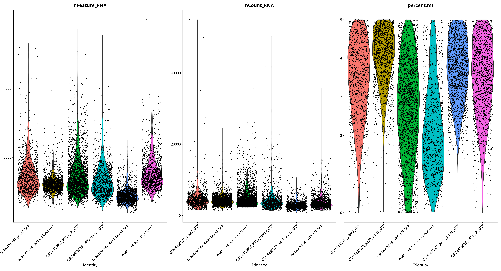
</p>

<p align="left"><em>
Fig 5 after 5% cutoff
</em></p>
<br>

#### 4.7 SCT - Dim. Reduction - Clustering 

<p align="left">
  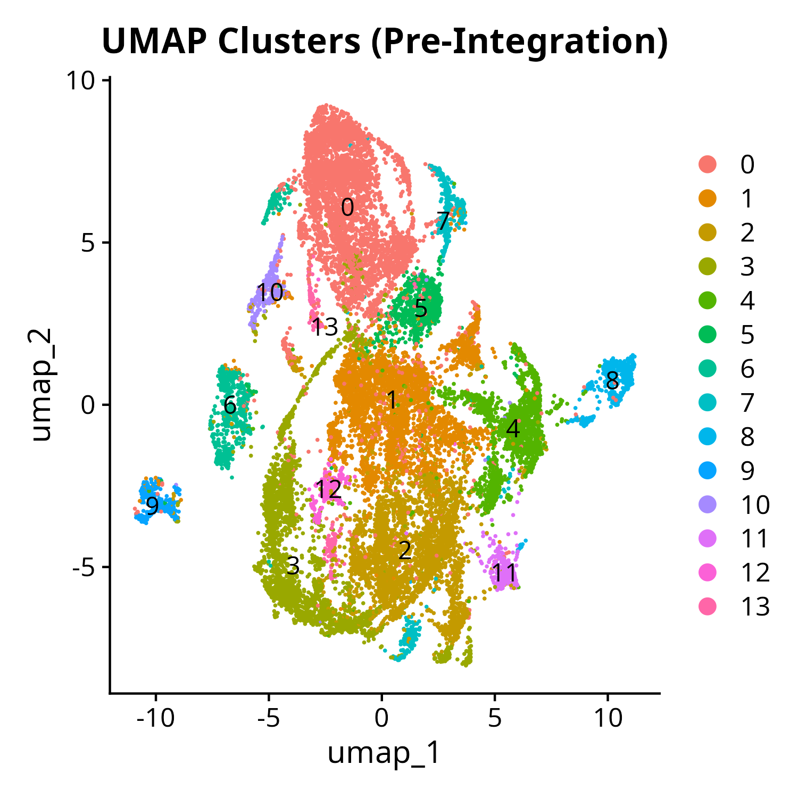
</p>

<p align="left"><em>
Fig . UMAP_Pre_Integration
</em></p>
<br>
<br>
<br>
<br>


#### 4.8 Removing TCR-genes before integration

Clustering should be only influenced by the T cell state.
<br>
<br>


**why remove TCR-genes**

T-cell receptors (TCRs) are extremely diverse, just as diverse as the vast array of different antigens they are supposed to recognize. Consequently, their genes-transcripts are just as diverse.

**If we did not remove these genes, clustering would heavily influenced by the different TCRs.**

But we don't want that!

Instead, we want the **clustering to be based only on receptors and corresponding genes**
that **define the state of the T cells**, e.g. Precursor/Progenitor/TPEX-like, Activ/Glycolytic, Cytotoxic/Effector/Exhausted, etc.
<br>
<br>
**EDA**
```
>       tcr_genes
  [1] "TRGC2"       "TRGC1"       "TRGV10"      "TRGV9"       "TRGV8"       "TRGV7"       "TRGV5"       "TRGV5P"      "TRGV4"       "TRGV3"       "TRGV2"       "TRGV1"       "TRBV1"      
 [14] "TRBV2"       "TRBV3-1"     "TRBV4-1"     "TRBV5-1"     "TRBV6-1"     "TRBV4-2"     "TRBV6-2"     "TRBV7-2"     "TRBV6-4"     "TRBV7-3"     "TRBV9"       "TRBV10-1"    "TRBV11-1"   
 [27] "TRBV10-2"    "TRBV11-2"    "TRBV12-2"    "TRBV6-5"     "TRBV7-4"     "TRBV5-4"     "TRBV6-6"     "TRBV5-5"     "TRBV7-6"     "TRBV5-6"     "TRBV7-7"     "TRBV7-9"     "TRBV13"     
 [40] "TRBV10-3"    "TRBV11-3"    "TRBV12-3"    "TRBV12-4"    "TRBV12-5"    "TRBV14"      "TRBV15"      "TRBV18"      "TRBV19"      "TRBV20-1"    "TRBV21-1"    "TRBV23-1"    "TRBV24-1"   
 [53] "TRBV25-1"    "TRBV27"      "TRBV28"      "TRBC1"       "TRBV29-1"    "TRBJ1-6"     "TRBJ2-1"     "TRBJ2-3"     "TRBJ2-5"     "TRBJ2-7"     "TRBC2"       "TRBV30"      "TRAV1-1"    
 [66] "TRAV1-2"     "TRAV2"       "TRAV3"       "TRAV4"       "TRAV5"       "TRAV6"       "TRAV8-1"     "TRAV10"      "TRAV12-1"    "TRAV8-2"     "TRAV8-3"     "TRAV13-1"    "TRAV12-2"   
 [79] "TRAV8-4"     "TRAV13-2"    "TRAV14DV4"   "TRAV9-2"     "TRAV15"      "TRAV12-3"    "TRAV8-6"     "TRAV16"      "TRAV17"      "TRAV18"      "TRAV19"      "TRAV20"      "TRAV21"     
 [92] "TRAV22"      "TRAV23DV6"   "TRDV1"       "TRAV24"      "TRAV25"      "TRAV26-1"    "TRAV27"      "TRAV29DV5"   "TRAV30"      "TRAV26-2"    "TRAV34"      "TRAV35"      "TRAV36DV7"  
[105] "TRAV38-1"    "TRAV38-2DV8" "TRAV39"      "TRAV40"      "TRAV41"      "TRDC"        "TRDV3"       "TRAC"        "TRBJ1-1"     "TRBJ1-5"     "TRBJ2-2"     "TRBJ2-6"     "TRDV2"      
[118] "TRAJ39"      "TRAJ37"      "TRBV6-7"     "TRBV16"      "TRBJ1-2"     "TRBJ2-4"     "TRAV8-5"     "TRAJ41"      "TRAJ38"      "TRAJ27"      "TRAJ16"      "TRAJ9"       "TRAJ7"      
[131] "TRAJ6"       "TRBV20OR9-2" "TRGV11"      "TRBV6-8"     "TRAJ42"      "TRBV5-3"     "TRBV5-7"     "TRBJ1-4"     "TRAJ40"      "TRAJ34"  

>       head(keep_genes, 20)
 [1] "FO538757.2"    "RP11-206L10.9" "LINC00115"     "NOC2L"         "KLHL17"        "PLEKHN1"       "HES4"          "ISG15"         "RP11-54O7.11"  "AGRN"          "C1orf159"     
[12] "TNFRSF18"      "TNFRSF4"       "SDF4"          "B3GALT6"       "FAM132A"       "UBE2J2"        "ACAP3"         "PUSL1"         "CPSF3L"       

>       length(tcr_genes)
[1] 140

>       length(keep_genes)
[1] 15248
> 
```
<br>
<br>
<br>


#### 4.9 Integration (CCA)

Integration removes effects of patient/tissue differences on the clustering

<br>
<br>

<p align="left">
  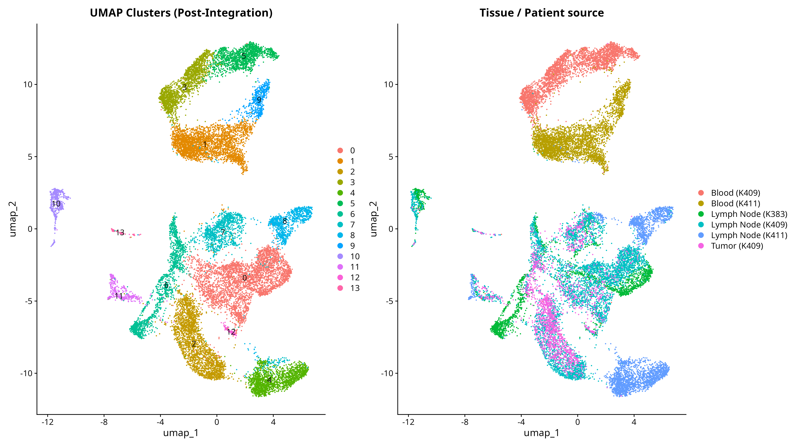
</p>

<p align="left"><em>
Fig . p_int_check
</em></p>

**Blood samples** were included as a negative control and to show the complete picture. They are well separated in the UMAP clusters 1, 3, 5, 9 and the tissue analysis (B) proves that. Therefore they **do not influence the analysis.**
<br>
<br>
<br>

#### 4.10 Normalization & UMAP Comparison

We set the resolution, so that we get the same amount of clusters as the original study.

<p align="left">
  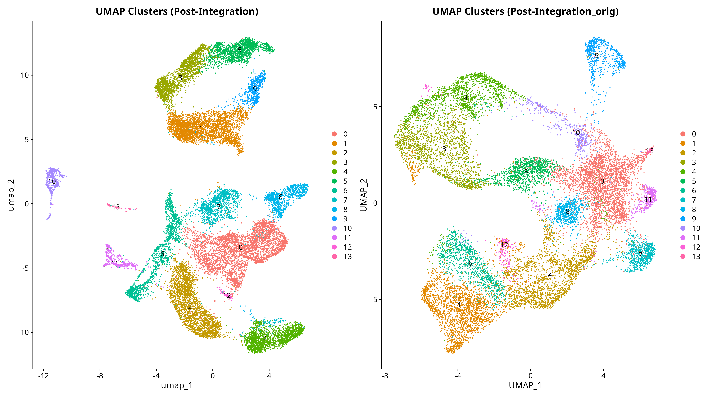
</p>

<p align="left"><em>
Fig . p_main1b
</em></p>
<br>
<br>


#### 4.11  Reliable reproduction and comparability of the results with the original study using a confusionmatrix and UMAPs of commonalities

Confusionmatrix - possible reasons for the layout:

- subset of original dataset

- T cells are not strictly isolated groups, but a fluid continuum

<p align="left">
  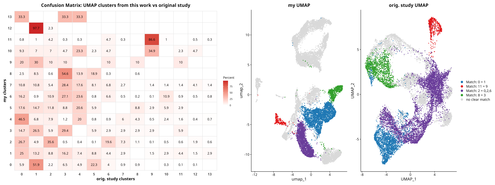
</p>

**Is a reliable reproduction and comparability possible despite the subset?**

The confusion matrix and the UMAPs of commonalities show that **fundamental cell populations** and **essential cluster structures** are **largely preserved**, even with a lower cell count. This is a solid basis to get **comparable results** in the next analysis steps - but a strict 1-to-1 comparison is not possible.
<br>
<br>


#### 4.12. Gene-signature scoring w. ModuleScore / Differential expression

ModuleScore(CPHi_Score1) calculates for every single cell how strongly it expresses the **46 CP-Hi signature genes** (from bulk RNA analysis) on average, relative to a randomly selected group of control genes with similar expression levels.

<br>
<p align="left">
  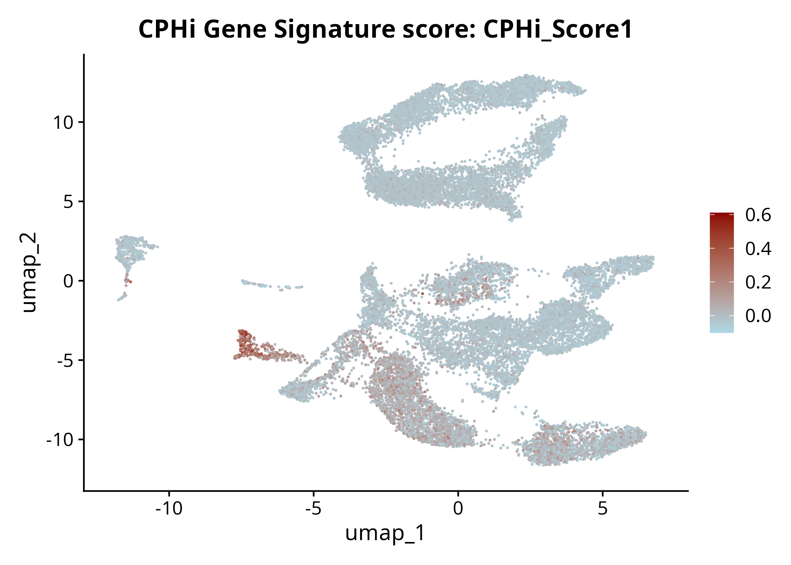
</p>

<p align="left"><em>
Fig . 17_CPHi_ModuleScore200_FeaturePlot: UMAP of ModuleScore(CPHi_Score1)
</em></p>
<br>
<br>


#### 4.13 Methods for CPHi/CPLo-classifikation 

**METHOD 1:** CPHi signature Score based on Module Score (by mean and 1 SD)

basis is the CPHi signature of 46 genes (from bulk RNA analysis)

**METHOD 2:** Classification by avg Module Score by Cluster

basis is the CPHi signature of 46 genes (from bulk RNA analysis)

**METHOD 3:** PDCD1/CTLA4 Coexpression: only double-positive cells are "CPHi"
<br>
<br>
<p align="left">
  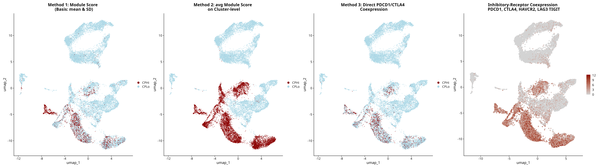
</p>

<p align="left"><em>
Fig . 4methods_cphi
</em></p>
<br>


#### 4.14. Inhibitory-receptor coexpression: SUM of "PDCD1", "CTLA4", "HAVCR2", "LAG3" "TIGIT"

Summing normalized counts is a quick, but raw metric. The hi-scoring **largely maps to CP-Hi**.
<br>
<br>
<br>
        
   
#### 4.15 TCR clonotype analysis

In the immune response T cells cloning is activated, creating **"Expanded"** cell populations. Expanded **largely map to CP-Hi** on the plot.

```
> table(sc_obj_int$Clonal_Expansion)

Expanded/Cloned       Singleton 
           3437           16502 

```
<p align="left">
  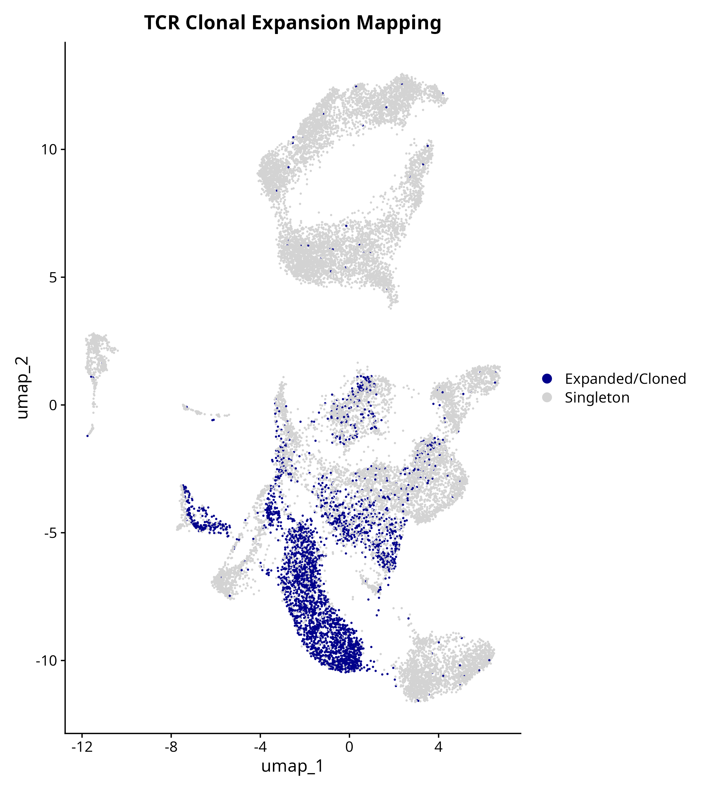
</p>

<p align="left"><em>
Fig . 20_TCR_Clonal_Expansion_UMAP
</em></p>
<br>
<br>
<br>


#### 4.16. TITAN Topic Modeling (Soft Clustering)

TITAN produces fluid borders instead of hard clusters for every topic.

<p align="left">
  
</p>

<p align="left"><em>
Fig . main3_titan
</em></p>
<br>


#### Validate TITAN Topics

```
>titan_top_genes
      Topic_1  Topic_2   Topic_3
1        RPL3     LDHA      CCL5
2       RPS12   SLC2A3      CYBA
3        RPS8    GAPDH      CST7
4       RPL32      MIF      NKG7
5        RPS6     TPI1      CD8A
6       RPL13   TMSB4X       CD7
7      EEF1A1    DDIT4       CD2
8       RPS18    CYTIP      ACTB
9      MT-CO2    ALDOA      CFL1
10      RPL10    HSPD1      OAZ1
11       RPS2    SYTL3      MYL6
12      RPLP0    PGAM1      CD74
13       IL7R    TAF1D      LSP1
14 AC090498.1      EMD    ARPC1B
15      RPLP1     ENO1     GAPDH
16     PABPC1     SAT1      CD8B
17       FTH1      GPI     CRIP1
18     MALAT1   BNIP3L   RARRES3
19      TXNIP     WSB1      IL32
20      RPL28   TUBA4A      PFN1
21      H3F3B     TUBB      PRF1
22     TMSB10     FTH1     CLIC1
23        LTB     PGK1     HLA-A
24       JUNB     CREM       FTL
25   HSP90AA1      EZR      LY6E
...
101      TCF7   FAM118A       JAML
...
120        UBB HIST1H4C     GSTP1
```
<br>
<br>

**Topic 1: Highly likely Precursor / Progenitor T cells/ TPEX-like**

gene expression evidence: IL7R, LTB, TXNIP, ZFP36, ZFP36L2, TCF7, LEF1

Noise: In column 1, at first glance, we see almost exclusively genes starting with RPS or RPL (e.g., RPL3, RPS12).
These are ribosomal proteins (building blocks of ribosomes). In resting or preparatory cells, these account for an extremely large portion of the RNA. This is typical biological "noise".

IL7R (Rank 13): The interleukin-7 receptor is the canonical marker for naive T cells and long-lived memory or progenitor cells (Tpex). It ensures the survival of the cell in a resting state.

LTB (Rank 23): Lymphotoxin beta. A typical signaling molecule of resting or tissue-resident precursor cells in lymphoid structures.

JUNB (Rank 24): A transcription factor that is active in resting or slowly adapting cells and controls basal survival processes.

VIM (Rank 26): Vimentin. A cytoskeletal protein that maintains structural stability in non-hyperactive, long-lived cells.

CD69 (Rank 38): An established marker for tissue-resident memory cells waiting for signals in the tissue.

DUSP1 (Rank 41): Dual specificity phosphatase 1. A regulatory gene that intercepts excessive stress and inflammatory signals to keep the cell in balance (homeostasis).
<br>
<br>


**Topic 2: Highly likely Metabolically Active/Activated/Glycolytic T cells;**

gene expression evidence: LDHA, SLC2A3, GAPDH, TPI1, ALDOA, PGAM1, ENO1, GPI, PGK1, PKM.

The top of this topic consists of glucose metabolism enzymes!

LDHA (Rank 1): Lactate dehydrogenase A. The key enzyme of anaerobic glucose metabolism, providing rapid energy for the active combat of effector cells.

SLC2A3 (Rank 2): Glucose transporter 3 (GLUT3). The "gateway" through which the cell pulls glucose from its environment into its interior.

GAPDH (Rank 3): Glyceraldehyde-3-phosphate dehydrogenase. A central enzyme of the glycolysis cascade that is massively upregulated in active cells.

MIF (Rank 4): Macrophage migration inhibitory factor. An important stress and survival factor for high-energy immune cells in tissues.

TPI1 (Rank 5): Triosephosphate isomerase. An indispensable metabolic enzyme that guarantees the smooth operation of accelerated glucose breakdown.

ALDOA (Rank 9): Aldolase A. Cleaves fructose as part of the massively upregulated cellular glycolysis.
<br>
<br>


**Topic 3: Cytotoxic / Effector / (Terminally) Exhausted T cells;**

gene expression evidence: CCL5, NKG7, PRF1, GNLY, GZMA, GZMB, CST7, LAG3.

These cells are former killer cells that have burned out from continuous combat, reflected by the combination of cytotoxicity and checkpoints.

CCL5 (Rank 1): A potent chemokine secreted by highly activated and exhausted T cells to recruit other immune cells to the site of action.

NKG7 (Rank 4): A membrane-bound protein in cytotoxic granules that controls the release of cell-killing molecules.

CD8A (Rank 5): The unmistakable co-receptor of CD8+ cytotoxic T cells, cementing the cellular identity of this population.

PRF1 (Rank 21): Perforin 1. The "drilling protein" traditionally used by killer cells to "punch holes" in target cells (evidence of the cytotoxic origin of the exhaustion).

LAG3 (Rank 32): Lymphocyte-activation gene 3. is a clear evidence for terminal exhaustion (CPHi).

GZMB (Rank 43): Granzyme B. The classic killer protease that is delivered into the tumor cell after docking to destroy it from the inside.
 
<br>
<br>
<br>


#### 4.17 Azimuth Classification with Tonsil-Reference

An **attempt** at reference based cell type classification was made using Azimuth. The most appropriate references available (PBMC and the Tonsil) were tested. **Neither effectively classified** cells in the dataset.
<br>
<br>
<p align="left">
  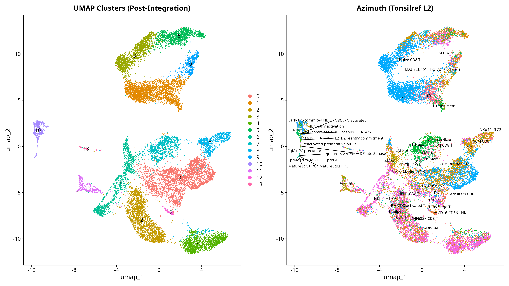
</p>

<p align="left"><em>
Fig . p_azimut_vs_seurat
</em></p>
<br>
<br>
<br>


#### 4.18 Functional Manual Annotation (work in progress)
<br>
<br>
<br>
<br>
<br>
<br>

### 5. Original Study /Dataset Availability 

Mahuron / Pauken et al. 2025

Author: Kelly M. Mahuron et al.

Title: Single-Cell Analyses Reveal a Functionally Heterogeneous Exhausted CD8+ T Cell Subpopulation that is Correlated with Response to Checkpoint Therapy in Melanoma

Organisation: UCSF; Harvard/MD Anderson; Pauken Lab / University of Pennsylvania


**Links:**

PMC article: https://pmc.ncbi.nlm.nih.gov/articles/PMC12356630/

GitHub: https://github.com/kepauken/TIL-heterogeneity-associated-with-ICI-response-in-melanoma

bulk RNA Dataset / GEO GSE147620: https://www.ncbi.nlm.nih.gov/geo/query/acc.cgi?acc=GSE147620

sc RNA dataset 1/ GEO GSE148190: https://www.ncbi.nlm.nih.gov/geo/query/acc.cgi?acc=GSE148190

sc RNA dataset 2/ GEO GSE159251: https://www.ncbi.nlm.nih.gov/geo/query/acc.cgi?acc=GSE159251

<br>
<br>


© 2026 Georg Sommer
